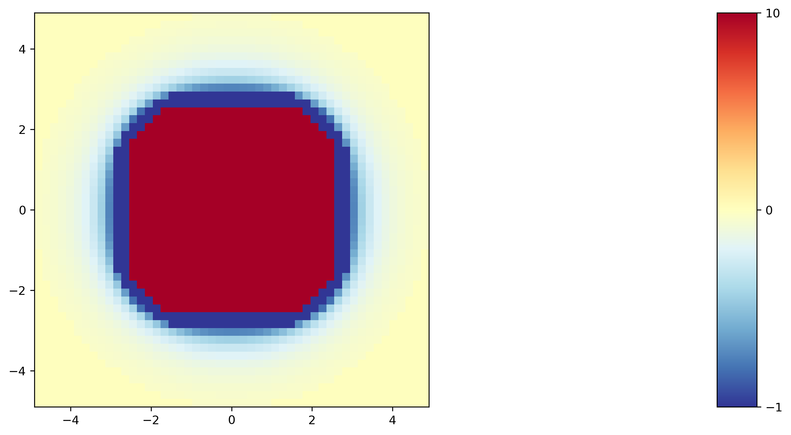

=================
Probe an ALJ cube
=================

.. code-block:: python

    import p4

    def cube_vertices(side_length):
        s = side_length
        return [
            [-s/2, -s/2, -s/2],
            [-s/2, -s/2,  s/2],
            [-s/2,  s/2, -s/2],
            [-s/2,  s/2,  s/2],
            [ s/2, -s/2, -s/2],
            [ s/2, -s/2,  s/2],
            [ s/2,  s/2, -s/2],
            [ s/2,  s/2,  s/2]
        ]

    def cube_faces():
        return [
            [0, 2, 6, 4],
            [0, 4, 5, 1],
            [4, 6, 7, 5],
            [0, 1, 3, 2],
            [2, 3, 7, 6],
            [1, 5, 7, 3],
        ]

    probe = p4.Body("A")
    analyte = p4.Body("B")

    interactions = [
        p4.Interaction(
            hoomd_class=hoomd.md.pair.aniso.ALJ,
            initial_args=dict(),
            default_params=dict(
                r_cut=0,
                params=dict(
                    epsilon=0,
                    sigma_i=1,
                    sigma_j=1,
                    alpha=0
                )
            ),
            typed_params={
                ("A", "B"): dict(
                    r_cut=5,
                    params=dict(
                        epsilon=2,
                        sigma_i=2,
                        sigma_j=2,
                        alpha=3
                    )
                ),
                "A": dict(
                    shape=dict(
                        vertices=cube_vertices(2),
                        faces=cube_faces()
                    )
                ),
                "B": dict(
                    shape=dict(
                        vertices=get_cube_vertices(2),
                        faces=get_cube_faces()
                    )
                )
            }
        )
    ]

    system = p4.System(probe, analyte, interactions)

    nlist = hoomd.md.nlist.Cell(10)

    system.probe_potential(
        position_resolutions=[50, 50, 1],
        orientation_resolutions=[1, 1, 10],
        symmetries=[1, 1, 4],
        nlist=nlist,
        csv_filename="alj-cube.csv",
        outside_cutoff=10,
        n_processes=-1
    )

    field = p4.Field.from_csv("alj-cube.csv", "mean")
    field.plot(fill_nan_with_inf=True)

