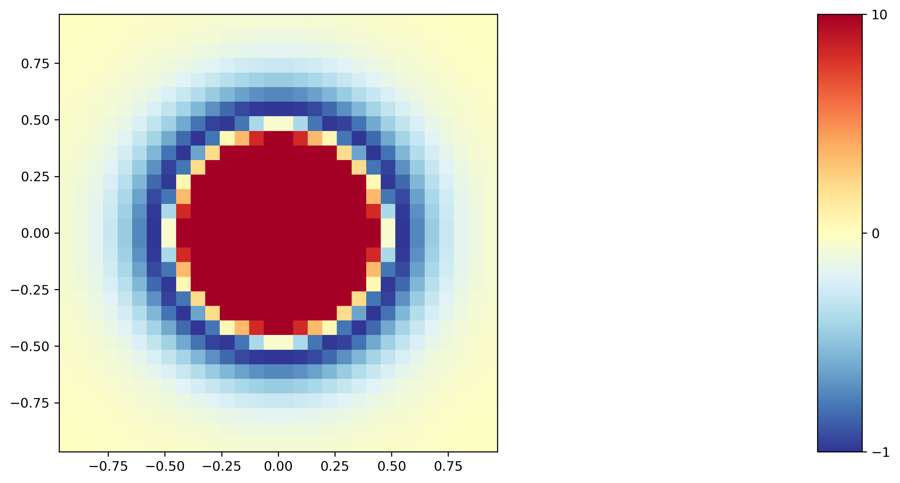

=================
Probe a LJ sphere
=================

.. code-block:: python

    import p4
    import hoomd

    probe = p4.Body("A")
    analyte = p4.Body("A")

    interactions = [
        p4.Interaction(
            hoomd_class=hoomd.md.pair.LJ,
            initial_args=dict(),
            default_params=dict(
                r_cut=0,
                params=dict(
                    epsilon=0,
                    sigma=1
                )
            ),
            typed_params={
                ("A", "A"): dict(
                    r_cut=5,
                    params=dict(
                        epsilon=1,
                        sigma=0.5
                    )
                )
            }
        )
    ]

    system = p4.System(probe, analyte, interactions)

    nlist = hoomd.md.nlist.Cell(10)

    system.probe_potential(
        position_resolutions=[30, 30, 1],
        orientation_resolutions=[1, 1, 1],
        symmetries=[1, 1, 1],
        nlist=nlist,
        csv_filename="lj-sphere.csv",
        outside_cutoff=2.0,
    )

    field = p4.Field.from_csv("lj-sphere.csv", "mean")
    field.plot()

